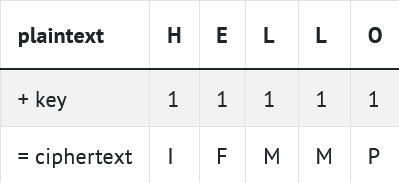

**Caeser**
<hr>

Implement a program that encrypts messages using Caesar’s cipher, per the below.

```dotnetcli
dotnet run 13
plaintext:  HELLO
ciphertext: URYYB
```

**Background**
<hr>

Supposedly, Julius Caesar used to “encrypt” (i.e., conceal in a reversible way) confidential messages by shifting each letter therein by some number of places. For instance, he might write A as B, B as C, C as D, …, and, wrapping around alphabetically, Z as A. And so, to say HELLO to someone, Caesar might write IFMMP. Upon receiving such messages from Caesar, recipients would have to “decrypt” them by shifting letters in the opposite direction by the same number of places.

The secrecy of this “cryptosystem” relied on only Caesar and the recipients knowing a secret, the number of places by which Caesar had shifted his letters (e.g., 1). Not particularly secure by modern standards, but, hey, if you’re perhaps the first in the world to do it, pretty secure!

Unencrypted text is generally called plaintext. Encrypted text is generally called ciphertext. And the secret used is called a key.
<br><br>

To be clear, then, here’s how encrypting HELLO with a key of 1 yields IFMMP:



<br><br>

More formally, Caesar’s algorithm (i.e., cipher) encrypts messages by “rotating” each letter by k positions. More formally, if p is some plaintext (i.e., an unencrypted message), p¡ is the ith character in p, and k is a secret key (i.e., a non-negative integer), then each letter, c¡, in the ciphertext, c, is computed as

$$c_¡ = (p_¡ + k) mod 26 $$

This formula perhaps makes the cipher seem more complicated than it is, but it’s really just a concise way of expressing the algorithm precisely. Indeed, for the sake of discussion, think of A (or a) as 0, B (or b) as 1, …, H (or h) as 7, I (or i) as 8, …, and Z (or z) as 25. 

Suppose that Caesar just wants to say Hi to someone confidentially using, this time, a key, k, of 3. And so his plaintext, p, is Hi, in which case his plaintext’s first character, p0, is H (aka 7), and his plaintext’s second character, p1, is i (aka 8). His ciphertext’s first character, c0, is thus K, and his ciphertext’s second character, c1, is thus L. Can you see why?

Let’s write a program called caesar that enables you to encrypt messages using Caesar’s cipher. At the time the user executes the program, they should decide, by providing a command-line argument, on what the key should be in the secret message they’ll provide at runtime. We shouldn’t necessarily assume that the user’s key is going to be a number; though you may assume that, if it is a number, it will be a positive integer.

Here are a few examples of how the program might work. For example, if the user inputs a key of 1 and a plaintext of HELLO:

```dotnetcli
dotnet run 1
plaintext:  HELLO
ciphertext: IFMMP
```

Here’s how the program might work if the user provides a key of 13 and a plaintext of hello, world:

```dotnetcli
dotnet run 13
plaintext:  hello, world
ciphertext: uryyb, jbeyq
```

Notice that neither the comma nor the space were “shifted” by the cipher. Only rotate alphabetical characters!

How about one more? Here’s how the program might work if the user provides a key of 13 again, with a more complex plaintext:

```dotnetcli
dotnet run 13
plaintext:  be sure to drink your Ovaltine
ciphertext: or fher gb qevax lbhe Binygvar
```

Notice that the case of the original message has been preserved. Lowercase letters remain lowercase, and uppercase letters remain uppercase.

**Specification**
<hr>

Design and implement a program, caesar, that encrypts messages using Caesar’s cipher.

- Your program must accept a single command-line argument, a non-negative integer. Let’s call it k for the sake of discussion.

- If your program is executed without any command-line arguments or with more than one command-line argument, your program should print an error message of your choice and end. 

- If any of the characters of the command-line argument is not a decimal digit, your program should print the message: 
"Usage: dotnet run key" and end. 

- Do not assume that k will be less than or equal to 26. Your program should work for all non-negative integral values of k less than 2^31 - 26. In other words, you don’t need to worry if your program eventually breaks if the user chooses a value for k that’s too big or almost too big to fit in an int. (Recall that an int can overflow.) But, even if k is greater than 26, alphabetical characters in your program’s input should remain alphabetical characters in your program’s output. For instance, if k is 27, A should not become [ even though [ is 27 positions away from A in ASCII, per http://www.asciichart.com/[asciichart.com]; A should become B, since B is 27 positions away from A, provided you wrap around from Z to A.

- Your program must output plaintext: (without a newline) and then prompt the user for a string of plaintext (using get_string).

- Your program must output ciphertext: (without a newline) followed by the plaintext’s corresponding ciphertext, with each alphabetical character in the plaintext “rotated” by k positions; non-alphabetical characters should be outputted unchanged.

- Your program must preserve case: capitalized letters, though rotated, must remain capitalized letters; lowercase letters, though rotated, must remain lowercase letters.

- Feel free to google examples of how to accomplish smaller tasks, but do **not** make use of any C# functionality we haven't yet discussed. You're encouraged to explore C#'s documentation, but using extra functions and features will defeat the purpose of this problem set. 

<br><br>


**Pseudocode**
<hr>
<br>

**The following is optional, but may help you along the way.**

How to begin? Let’s approach this problem one step at a time.

<br>

First, write some pseudocode that implements this program, even if not (yet!) sure how to write it in code. There’s no one right way to write pseudocode, but short English sentences suffice. Odds are your pseudocode will use (or imply using!) one or more functions, conditions, Boolean expressions, loops, and/or variables.

There’s more than one way to do this, so here’s just one!

1.  Check that program was run with one command-line argument

2. Iterate over the provided argument to make sure all characters are digits

3. Convert that command-line argument from a string to an int

4. Prompt user for plaintext

5. Iterate over each character of the plaintext:

    1. If it is an uppercase letter, rotate it, preserving case, then print out the rotated character

    2. If it is a lowercase letter, rotate it, preserving case, then print out the rotated character

    3. If it is neither, print out the character as is

6. Print a newline


**Counting Command-Line Arguments**
<hr>

Whatever your pseudocode, let’s first write only the C# code that checks whether the program was run with a single command-line argument before adding additional functionality.

Specifically, modify the program in such a way that: if the user provides exactly one command-line argument, it prints Success; if the user provides no command-line arguments, or two or more, it prints 

```dotnetcli
dotnet run
Usage: dotnet run key
```

 Remember, since this key is coming from the command line at runtime, and not via get_string, we don’t have an opportunity to re-prompt the user. The behavior of the resulting program should be like the below.
 
```dotnetcli
dotnet run 20
success
```
 
```dotnetcli
dotnet run
Usage: dotnet run key
```
 
```dotnetcli
dotnet run 1 2 3
Usage: dotnet run key
```

**Accessing the Key**
<hr>

Now that your program is (hopefully!) accepting input as prescribed, it’s time for another step.

Recall that in our program, we must defend against users who technically provide a single command-line argument (the key), but provide something that isn’t actually an integer, for example:

```dotnetcli
dotnet run xyz
```

Before we start to analyze the key for validity, though, let’s make sure we can actually read it. Further modify your program such that it not only checks that the user has provided just one command-line argument, but after verifying that, prints out that single command-line argument. So, for example, the behavior might look like this:

```dotnetcli
dotnet run 20
success
20
```

**Validating the Key**
<hr>
Now that you know how to read the key, let’s analyze it. Modify your program such that instead of printing out the command-line argument provided, your program instead checks to make sure that each character of that command line argument is a decimal digit (i.e., 0, 1, 2, etc.) and, if any of them are not, terminates after printing the message "Usage: dotnet key". But if the argument consists solely of digit characters, you should convert that string (recall that args is an array of strings, even if those strings happen to look like numbers) to an actual integer, and print out the integer. So, for example, the behavior might look like this:

```dotnetcli
dotnet run 20
success
20
```

or  

```dotnetcli
dotnet run 20x
Usage: dotnet run key
```
**Peeking Underneath the Hood**
<hr>

As human beings it’s easy for us to intuitively understand the formula described above, inasmuch as we can say “H + 1 = I”. But can a computer understand that same logic? Let’s find out. For now, we’re going to temporarily ignore the key the user provided and instead prompt the user for a secret message and attempt to shift all of its characters by just 1.

Extend the functionality such that, after validating the key, we prompt the user for a string and then shift all of its characters by 1, printing out the result. We can also at this point probably remove the line of code we wrote earlier that prints Success. All told, this might result in this behavior:

```dotnetcli
dotnet run hello
plaintext:  hello
ciphertext: ifmmp
```

Now it’s time to tie everything together! Instead of shifting the characters by 1, modify your program to instead shift them by the actual key value. And be sure to preserve case! Uppercase letters should stay uppercase, lowercase letters should stay lowercase, and characters that aren’t alphabetical should remain unchanged.

**Final Hints**
<hr>


- Best to use the modulo (i.e., remainder) operator, %, to handle wraparound from Z to A! But how?

- Things get weird if we try to wrap Z or z by 1 using the technique in the previous section.

- Things get weird also if we try to wrap punctuation marks using that technique.

- Recall that ASCII maps all printable characters to numbers.

- Recall that the ASCII value of A is 65. The ASCII value of a, meanwhile, is 97.